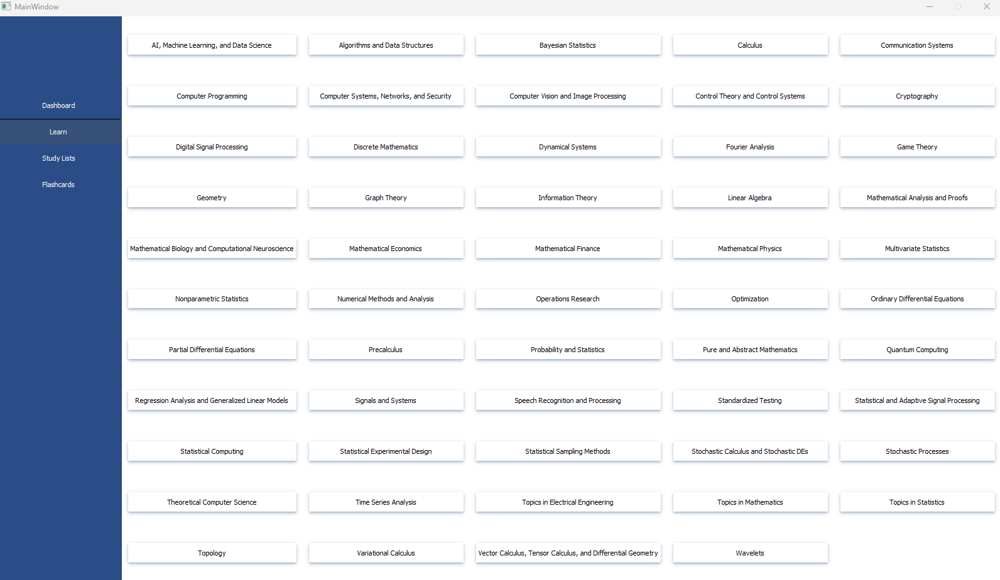
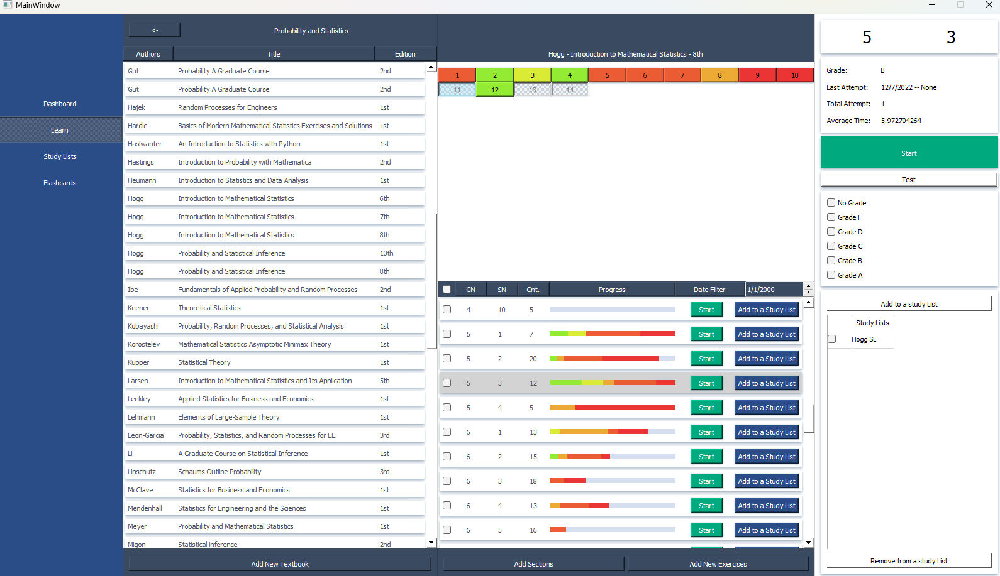
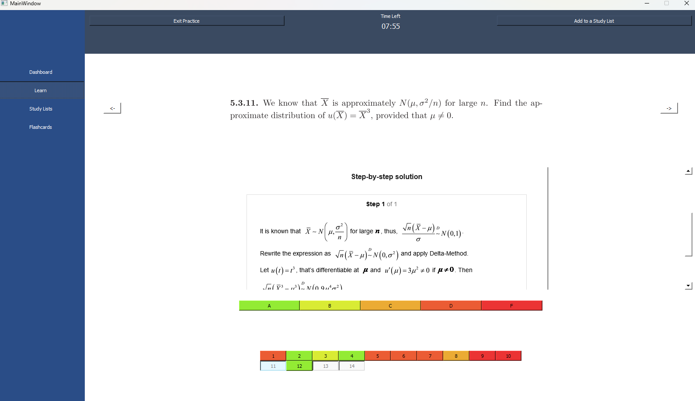
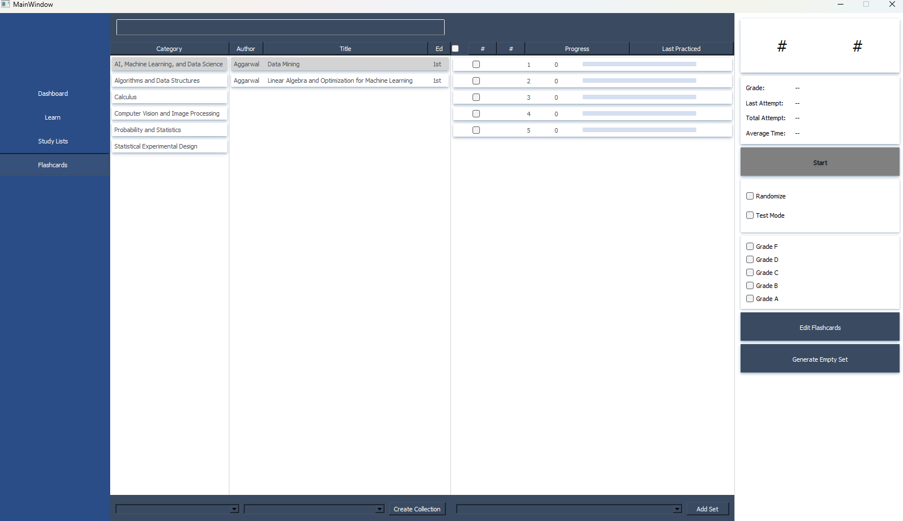
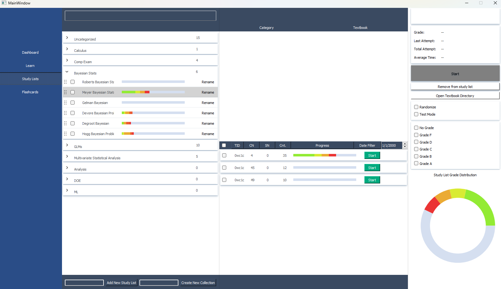
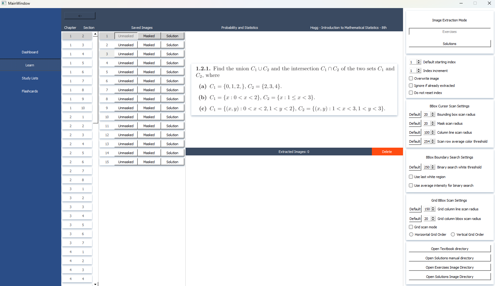

# Stephan Academy: A desktop learning platform to aid student's self-study in mathematics and science.

## Software Requirements

---

- Python 3
  - PyQT5
  - numpy
  - pillow
  - time
  - mysql.connecor
  - CV2
  - Keyboard
  - mss.tools
- MySQL

## Tutorial

---- 

### Subjects Page

### Textbook Problems Page
 
### Exercise Example
 
### Flashcards Page
 
### Study List Page
 
### Exercise Image Extraction Mode
